# AI Calorie Tracking System

🚀 A full-stack AI-powered fitness web application that uses computer vision and machine learning to identify food items from images, estimate their nutritional values, and dynamically track and visualize a user's daily nutrition goals.

## 🌟 Features

### Core Features
- **AI Food Detection**: YOLOv8-powered image analysis for food recognition
- **Nutrition Tracking**: Daily calorie and macronutrient tracking
- **Personalized Goals**: BMI, BMR, and TDEE calculation
- **Progress Visualization**: Interactive charts and progress indicators
- **Mobile Responsive**: Beautiful UI optimized for all devices

### Advanced Features
- **Multi-food Detection**: Identify multiple foods in a single image
- **Dietary Suggestions**: AI-powered nutrition recommendations
- **Weekly Reports**: Detailed nutrition analytics
- **User Profiles**: Personalized nutrition goals and preferences
- **Real-time Updates**: Live data synchronization

## 🏗️ System Architecture

The architecture diagram below uses Mermaid (flowchart) so it renders as clean boxes on GitHub and many Markdown viewers.

```mermaid
flowchart TD
   subgraph CLIENT["Client Layer<br/>(React.js Frontend)"]
      direction TB
      Dashboard[Dashboard]
      FoodUpload[Food Upload]
      Reports[Reports]
   end

   subgraph APP["Application Layer<br/>(Django REST Framework)"]
      direction TB
      Auth[Auth API]
      Detection[Detection API]
      Nutrition[Nutrition API]
   end

   subgraph AI["Intelligence Layer<br/>(AI/ML Processing)"]
      direction TB
      YOLO["YOLOv8 CNN<br/>(Feature extraction → Detection)<br/>Output: Food name + Confidence"]
      RF["Random Forest Classifier<br/>(Input: 7D nutrition vector)<br/>Output: Category + Confidence"]
      Fusion["Ensemble Fusion<br/>Final output"]
      YOLO --> RF
      RF --> Fusion
   end

   subgraph DATA["Data Layer<br/>(PostgreSQL / SQLite)"]
      direction TB
      Users[User Profiles]
      NutritionDB[Nutrition Database]
      History[Detection History]
   end

   %% Connections (point to API nodes instead of subgraph IDs)
   Dashboard -->|HTTP/REST| Detection
   FoodUpload -->|HTTP/REST| Detection
   Reports -->|HTTP/REST| Nutrition

   Detection -->|calls / triggers| YOLO
   Detection -->|calls / triggers| RF
   Fusion -->|stores results| NutritionDB
   Fusion -->|stores results| History

   Auth -->|reads/writes| Users
   Detection -->|reads/writes| NutritionDB

   %% (Optional) style adjustments can be added if desired
```




## 🛠 Tech Stack

### Backend (Django)
- **Framework**: Django 5.2.4 with Django REST Framework
- **AI/ML**: YOLOv8 (Ultralytics), PyTorch, OpenCV
- **Database**: SQLite (dev), PostgreSQL (production ready)
- **Authentication**: Token-based authentication
- **File Handling**: Pillow for image processing

### Frontend (React)
- **Framework**: React 18 with TypeScript
- **Styling**: Tailwind CSS with custom design system
- **Charts**: Chart.js with react-chartjs-2
- **Icons**: Lucide React
- **HTTP Client**: Axios
- **Routing**: React Router DOM

## 📁 Project Structure

```
AI Calory Tracking System/
├── Backend/
│   ├── nutrition_backend/
│   │   ├── settings.py
│   │   └── urls.py
│   ├── api/
│   │   ├── models.py
│   │   ├── views.py
│   │   ├── urls.py
│   │   ├── serializers.py
│   │   ├── admin.py
│   │   └── food_detector.py
│   ├── media/
│   ├── requirements.txt
│   └── README.md
├── Frontend/
│   ├── public/
│   ├── src/
│   │   ├── components/
│   │   ├── pages/
│   │   ├── contexts/
│   │   ├── api/
│   │   ├── utils/
│   │   ├── App.tsx
│   │   ├── index.tsx
│   │   └── index.css
│   ├── tailwind.config.js
│   ├── tsconfig.json
│   ├── package.json
│   └── README.md
└── README.md
```

## 🚀 Quick Start

### Prerequisites
- Python 3.8+
- Node.js 16+
- npm or yarn

### Backend Setup

1. **Navigate to backend directory**
   ```bash
   cd Backend
   ```

2. **Create virtual environment**
   ```bash
   python -m venv venv
   ```

3. **Activate virtual environment**
   ```bash
   # Windows
   .\venv\Scripts\Activate.ps1
   
   # Linux/Mac
   source venv/bin/activate
   ```

4. **Install dependencies**
   ```bash
   pip install -r requirements.txt
   ```

5. **Run migrations**
   ```bash
   python manage.py makemigrations
   python manage.py migrate
   ```

6. **Create superuser**
   ```bash
   python manage.py createsuperuser
   ```

7. **Start Django server**
   ```bash
   python manage.py runserver
   ```

Backend will be available at `http://localhost:8000`

### Frontend Setup

1. **Navigate to frontend directory**
   ```bash
   cd Frontend
   ```

2. **Install dependencies**
   ```bash
   npm install
   ```

3. **Start React development server**
   ```bash
   npm start
   ```

Frontend will be available at `http://localhost:3000`

## 🔧 Configuration

### Environment Variables

Create `.env` files in both backend and frontend directories:

**Backend (.env)**
```
DEBUG=True
SECRET_KEY=your-secret-key
DATABASE_URL=sqlite:///db.sqlite3
ALLOWED_HOSTS=localhost,127.0.0.1
```

**Frontend (.env)**
```
REACT_APP_API_URL=http://localhost:8000/api
```

## 📊 API Endpoints

### Authentication
- `POST /api/auth/register/` - User registration
- `POST /api/auth/login/` - User login
- `GET /api/auth/logout/` - User logout

### User Profile
- `GET /api/profile/` - Get user profile
- `POST /api/profile/` - Create/update user profile

### Food Detection
- `POST /api/detect-food/` - Upload image for food detection
- `GET /api/detection-history/` - Get detection history

### Nutrition Tracking
- `GET /api/nutrition-log/` - Get daily nutrition logs
- `POST /api/nutrition-log/` - Add nutrition log entry
- `GET /api/nutrition-summary/` - Get daily nutrition summary
- `GET /api/weekly-report/` - Get weekly nutrition report

## 🤖 AI/ML Features

### Food Detection
- **YOLOv8 Model**: Pre-trained object detection
- **Custom Food Classes**: 10+ food categories
- **Confidence Scoring**: Accuracy assessment
- **Multi-food Support**: Detect multiple items

### Nutrition Database
- **Comprehensive Data**: 100+ food items
- **Macronutrients**: Protein, carbs, fats
- **Micronutrients**: Fiber, sugar, sodium
- **Serving Sizes**: Standardized portions

### Dietary Analysis
- **Protein Analysis**: Protein content recommendations
- **Fiber Assessment**: Fiber intake suggestions
- **Variety Tracking**: Food diversity monitoring
- **Personalized Tips**: User-specific recommendations

## 🎨 UI/UX Features

### Design System
- **Color Palette**: Primary, secondary, success, warning, danger
- **Typography**: Inter font family
- **Components**: Pre-built buttons, cards, forms
- **Animations**: Smooth transitions and micro-interactions

### Responsive Design
- **Mobile First**: Optimized for mobile devices
- **Tablet Support**: Responsive tablet layouts
- **Desktop Experience**: Full-featured desktop interface
- **Touch Friendly**: Mobile-optimized interactions

### Interactive Elements
- **Progress Bars**: Visual nutrition progress
- **Charts**: Weekly nutrition trends
- **Drag & Drop**: Easy image upload
- **Real-time Updates**: Live data synchronization

## 🔒 Security Features

- **Token Authentication**: Secure API access
- **CORS Protection**: Cross-origin request handling
- **Input Validation**: Form and data validation
- **File Upload Security**: Image size and type validation
- **Error Handling**: Graceful error management

## 📈 Performance

### Backend Optimizations
- **Database Indexing**: Optimized queries
- **Image Processing**: Efficient image handling
- **Caching**: Response caching
- **Async Processing**: Background tasks

### Frontend Optimizations
- **Code Splitting**: Route-based splitting
- **Lazy Loading**: Component lazy loading
- **Bundle Optimization**: Webpack optimization
- **Image Compression**: Automatic compression

## 🧪 Testing

### Backend Testing
```bash
cd Backend
python manage.py test
```

### Frontend Testing
```bash
cd Frontend
npm test
```

## 🚀 Deployment

### Backend Deployment
1. Set `DEBUG=False` in settings
2. Configure production database
3. Set up static files collection
4. Configure environment variables
5. Deploy to your preferred platform

### Frontend Deployment
1. Build production version: `npm run build`
2. Deploy to static hosting (Netlify, Vercel, etc.)
3. Configure environment variables
4. Set up domain and SSL

## 🤝 Contributing

1. Fork the repository
2. Create a feature branch
3. Make your changes
4. Add tests
5. Submit a pull request

## 📝 License

This project is licensed under the MIT License.

## 👨‍💻 Author

**Kevin Savaliya**

* GitHub: [@kevin-savaliya](https://github.com/kevin-savaliya)
* LinkedIn: [@kevin-savaliya](https://www.linkedin.com/in/kevin-savaliya-787794241/)

---

> ⭐️ **If you found this project helpful, please star the repository to support my work!**
